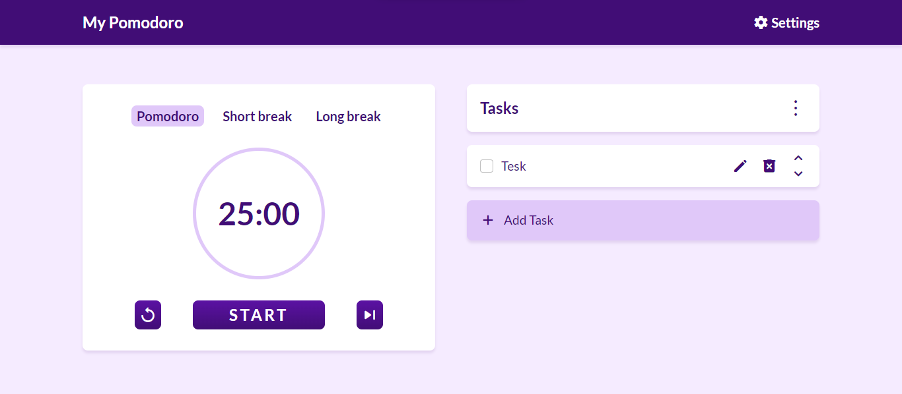

<h1 align="center">
    ⏲️MyPomodoro⏲️
</h1>

## 💻 Sobre o projeto

⏲️ MyPomodoro - É um projeto web para ajudar pessoas que desejam melhorar o gerenciamento do seu tempo
Este projeto foi desenvolvido utilizando Angular, typeScript e Bootstrap. Suas funcionalidades são voltadas para manutenção do tempo e controle de pequenas tarefas.

## ⚙️ Funcionalidades

- Acompanhar um cronometro para fragmentção do tempo
- Alterar configurações do tempo de cada estágio do pomodoro para melhor se adaptar ao usuário
- Gerenciar tarefas simples para o acompanhento de sua execução

## 🤔 O que é pomodoro?
A técnica Pomodoro é um método desenvolvido para o gerenciamento de tempo. Ela consiste na utilização de um cronômetro para divisão do tempo em períodos constantes de trabalho (geralmente de 25 minutos), separados por breves intervalos (normalmente de 5 minutos). Seu objetivo é melhorar o aproveitamento do tempo e reduzir o desgaste mental.

## 🎨 Layout

<p align="center" style="display: flex; align-items: flex-start; justify-content: center;">
  
</p>

## 🚀 Como executar o projeto

```bash

# Clone este repositório
$ git clone https://github.com/VictorM-Coder/My-Pomodoro.git

# Acesse a pasta do projeto e instale os pacotes necessários
$ npm i

# Inicie a aplicação com
$ ng serve

# A aplicação será aberta na porta:4200 - acesse http://localhost:4200

```

## 🛠 Tecnologias

As seguintes ferramentas foram usadas na construção do projeto:

#### **Frontend** 

-   **[Angular](https://angular.io)**
-   **[TypeScript](https://www.typescriptlang.org)**
-   **[Bootstrap](https://getbootstrap.com)**

#### **Utilitários**

-   Protótipo:  **[Figma](https://www.figma.com/)**
-   Editor: **[WebStorm IDEA](https://www.jetbrains.com/webstorm/)**
-   Fontes:  **[Lato](https://fonts.google.com/specimen/Lato)**

## ✌️ Autor

[Victor Martins](https://github.com/VictorM-Coder)
<div>
  <a href="https://www.instagram.com/iam_victor.martins/"></a> 
  <a href="https://www.linkedin.com/in/victor-martins-230864233/"></a> 
